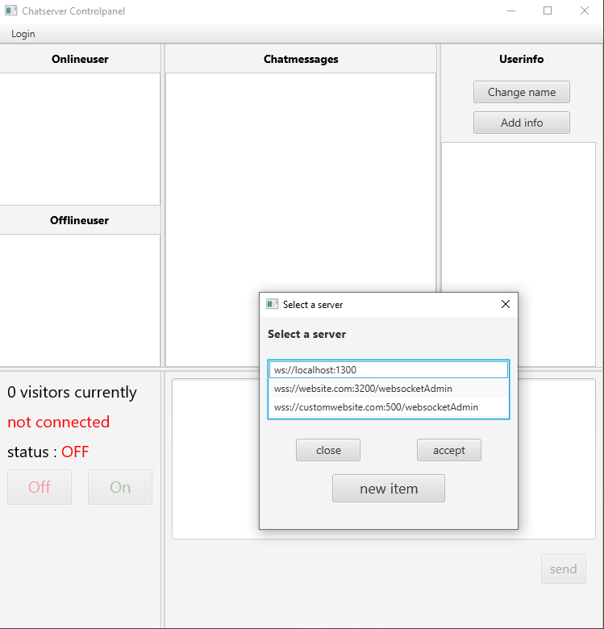

# Chatserver_Controlpanel

A desktop Application written in Kotlin with Tornadofx to connect to a
 [Chatserver](https://github.com/dominikwuttke/Chatserver)
 
 This application is a desktop application which can connect to a deployed [Chatserver](https://github.com/dominikwuttke/Chatserver)
 to enable chatting with visitors of a website, display infos about the status of the server,
 manage and alter information of users. 
 
 an executable version of this application can be downloaded as a jar(executable java file) at
 my homepage https://website.de.

 
 ## Functionality
 
 The Controlpanel has the following features
 
 * connect to any deployed [Chatserver](https://github.com/dominikwuttke/Chatserver)
 in 3 different ways
 * Chat with users connected to the Chatserver
 * rename users
 * add, modify and delete information to users
 * view status of the server(active and visiting users)
 
 The following picture shows the application when connected to a [Chatserver](https://github.com/dominikwuttke/Chatserver)
 
 
 
 When starting the application you can either provide the parameter URL,username and userpass or you
 can manually add these parameters when connecting. When providing the data at startup the
 controlpanel connect to the URL with the provided data when you click on login.
 If the login fails you have the option to enter values manually, in this case
 a json file is created to store the data for the future to create a list of servers and usernames
 to select from, like this picture.
 
 
 
 When you are connected to a server the URL and the name as whom you are connected are always
 displayed on the bottom left along with the current status of the server regarding
 the availability to chat.
 
 When you are connected, the chat features is disabled by default and must be activated by selecting
 *online* from the dropdown menu and can be turned off by selecting *offline*.
 Selecting any of these sends a message to the server, which sends the updated status to all connected
 clients.
 
 Upon connecting to the server, the server sends various information about the status of the server
 which are displayed. These information show how much users are currently visiting and how much are
 willing to chat(meaning they have at least sent 1 message in the past).
 
 Every user with whom you can chat is listed on the upper left screen with the according userID or name.
 The list is sorted by unread messages to not miss any messages from users. When the controlpanel
 is not on focus and a user sends a message a notification is sent to the operating system
 which will tell you, that you received a new message.
 
 When you select a user the server sends the complete chatlog and any additional information
 which have been added to this user. These information are provided by the server API and are
 displayed on the right side. For the selected user you can add information, which will be stored
 in a database at the server and you can change the userID to a name. The renamed
 user will then be listed by his name instead of his userID. 

##